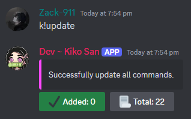

# Update

***

## Usage:

```
k!update
```

***

## Output:

<div align="left"><figure><figcaption></figcaption></figure></div>

***

## Source

> Are you interested in how this command works behind the scenes? Click [here](https://github.com/Kiko-Labs/Kiko-San/blob/stable/src/Prefix%20Commands/Developer/update.js) to view it. Oh and it might be a pure spaghetti, good luck, brave soul!
